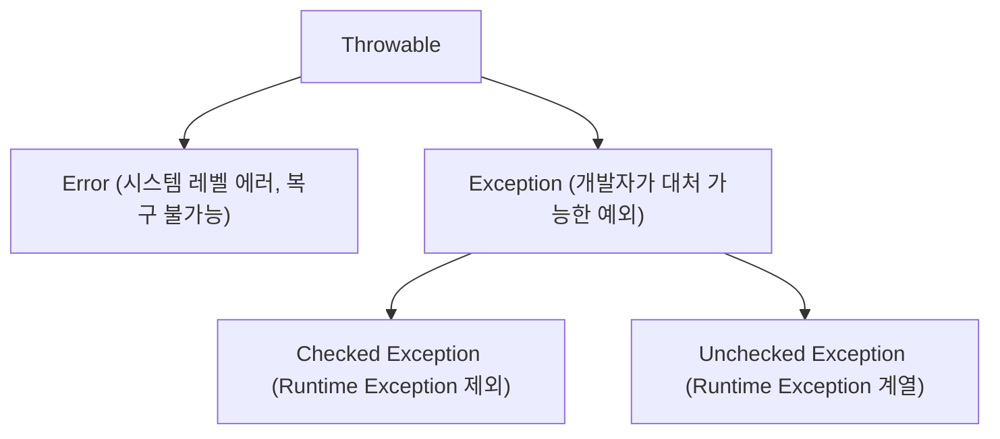

# Java 예외 처리 (Exception Handling) 정리

본 문서는 [Solution01.java](file:///Users/morgan/Documents/workspace/260626_ex/src/Solution01.java) 예제 코드를 기반으로 Java의 예외(
Exception) 처리 개념과 종류(Checked Exception vs Unchecked Exception)에 대해 상세히 설명합니다.

---

## 1. Java 예외 클래스 구조 (Hierarchy)

Java에서 모든 예외와 에러의 최상위 클래스는 `Throwable`이며, 크게 다음과 같이 분류됩니다.



* **Error**: OutOfMemoryError, StackOverflowError 등 프로그램 외부나 JVM 자체의 심각한 문제로 발생하며, 애플리케이션 코드 내에서 잡아서 복구할 수 없습니다.
* **Exception**: 애플리케이션 실행 중 개발자가 예방하거나 예외 처리를 통해 복구할 수 있는 오류들입니다.

---

## 2. Checked Exception vs Unchecked Exception

Java의 예외는 크게 컴파일 시점에 체크되는 **Checked Exception**과 실행 시점에 체크되는 **Unchecked (Runtime) Exception**으로 나뉩니다.

| 구분          | Checked Exception                                                     | Unchecked (Runtime) Exception                                                                           |
|:------------|:----------------------------------------------------------------------|:--------------------------------------------------------------------------------------------------------|
| **대표 클래스**  | `Exception` (RuntimeException 상속 제외), `IOException`, `SQLException` 등 | `RuntimeException` 상속 클래스 (`NullPointerException`, `ArithmeticException`, `IllegalArgumentException` 등) |
| **컴파일러 체크** | **체크함.** 처리 코드(`try-catch` 또는 `throws`) 누락 시 컴파일 에러 발생.               | **체크 안 함.** 명시적인 예외 처리를 강제하지 않음.                                                                        |
| **발생 시점**   | 주로 외부 환경(파일 I/O, 네트워크 접속, 데이터베이스 연동 등)과의 상호작용 시 발생.                   | 주로 프로그래머의 실수, 입력값 검증 실패 등 프로그램 비즈니스 로직 상의 문제로 발생.                                                       |

---

## 3. 코드 상세 분석

[Solution01.java](file:///Users/morgan/Documents/workspace/260626_ex/src/Solution01.java)에 작성된 각 예외 상황의 세부 설명입니다.

### ① Unchecked Exception (Runtime Exception)

코드 내에서 0으로 나누는 등 실행 도중 조건에 따라 예기치 않게 발생하는 예외입니다.

```java
int a = 10;
int b = (int) (Math.random() * 2 - 1); // -1 또는 0 발생 가능
System.out.

println(a /b);
```

* `b`가 0이 될 경우 `java.lang.ArithmeticException: / by zero`가 발생합니다.
* `ArithmeticException`은 `RuntimeException`을 상속한 **Unchecked Exception**이므로 컴파일러는 예외 처리를 강제하지 않습니다.

### ② Checked Exception 대응 방법

`HttpClient.send()` 메서드나 파일 입출력 등은 `IOException`, `InterruptedException`과 같은 Checked Exception을 던질 수 있도록 시그니처에 선언되어
있습니다.

Checked Exception을 발생시키는 메서드를 다룰 때는 반드시 아래 두 가지 중 하나의 방법으로 처리해야 합니다.

#### 방법 A: `try-catch`로 직접 예외 해결하기

```java
static void method1() {
    try {
        throw new Exception(); // Checked Exception 강제 발생
    } catch (Exception e) {
        // 직접 예외를 처리하여 복구함
    }
}
```

#### 방법 B: `throws` 키워드로 호출자에게 위임하기

```java
static void method1() throws Exception {
    throw new Exception(); // 호출한 상위 메서드로 예외 전달
}
```

* 이 경우 `method1()`을 호출하는 곳에서 다시 `try-catch`로 감싸거나, 자신도 `throws Exception`을 붙여 더 상위 레벨로 전파해야 합니다.

### ③ Unchecked Exception의 선택적 예외 처리

```java
static void method2() {
    throw new IllegalArgumentException(); // RuntimeException 계열 (강제 처리 대상 아님)
}
```

* `method2()`는 `IllegalArgumentException`을 던집니다. 이는 Unchecked Exception이기 때문에 메서드 시그니처에 `throws`를 선언할 의무가 없으며, 호출하는 쪽에서도
  반드시 `try-catch`로 감싸지 않아도 컴파일 에러가 발생하지 않습니다.
* 다만, 필요한 경우 호출부에서 아래와 같이 선택적으로 예외 처리를 진행할 수 있습니다.
  ```java
  try {
      method2();
  } catch (IllegalArgumentException e) {
      // 필요한 대응 작성
  }
  ```