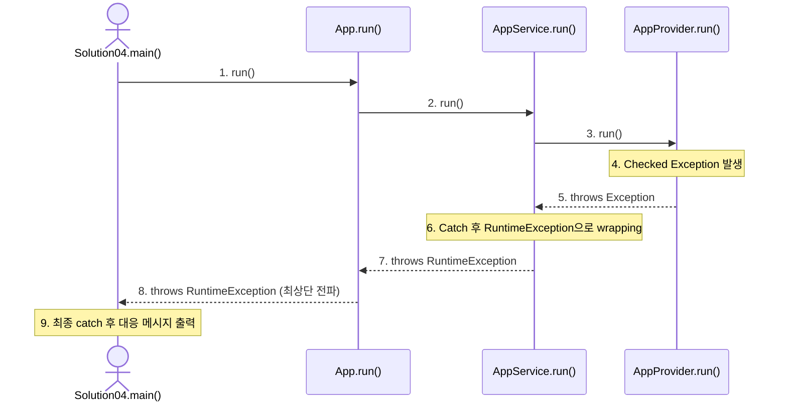

# Java 객체 지향 협력과 예외 전파 (Exception Propagation & Translation)

본 문서는 [Solution04.java](file:///Users/morgan/Documents/workspace/260626_ex/src/Solution04.java)와 `oop` 패키지 예제를 기반으로, 다중
객체 협력 구조에서 예외가 전파(Propagation)되는 흐름과 이를 변환(Translation/Wrapping)하여 처리하는 기법에 대해 상세히 설명합니다.

---

## 1. 객체 협력 구조와 예외 흐름

실습 예제는 다음과 같은 의존성 체인을 가집니다. `Solution04` (실행부)가 최상위 객체인 `App`을 실행하고, 내부적으로 하위 서비스와 프로바이더로 호출이 흘러갑니다.



---

## 2. 계층별 코드 및 예외 처리 흐름 분석

### ① [AppProvider.java](file:///Users/morgan/Documents/workspace/260626_ex/src/oop/AppProvider.java) (예외 발생지)

가장 깊은 계층(원인 제공자)에서 Checked Exception을 발생시킵니다.

```java
public class AppProvider {
    public void run() throws Exception {
        System.out.println("AppProvider.run");
        throw new Exception("AppProvider.run.exception"); // Checked Exception 던짐
    }
}
```

* `Exception`은 Checked Exception이므로 메서드 시그니처에 반드시 `throws Exception`을 명시해야 컴파일됩니다.

### ② [AppService.java](file:///Users/morgan/Documents/workspace/260626_ex/src/oop/AppService.java) (예외 변환 - Wrapping & Rethrow)

중간 계층에서 하위 계층의 Checked Exception을 잡아서 Unchecked Exception으로 변환(Wrapping)합니다.

```java
public void run() {
    System.out.println("AppService.run");
    try {
        appProvider.run();
    } catch (Exception e) {
        System.out.println("e.getClass() = " + e.getClass());
        System.out.println("AppService.run.exception.catch");
        System.out.println("rethrow");

        throw new RuntimeException(e); // Checked Exception을 Unchecked(Runtime)로 Wrapping하여 던짐
    }
    System.out.println("AppService.run.complete");
}
```

* **예외 변환(Exception Translation)의 이유**:
  Checked Exception을 그대로 상위 계층으로 던지게 되면, 이를 거치는 모든 중간 상위 메서드(`App.run()`, `main()` 등)의 시그니처에 `throws Exception`을 줄줄이 붙여야
  합니다. 이는 코드를 특정 하위 구현에 종속시키고 결합도를 높입니다.
* **Wrapping 기법**: `new RuntimeException(e)` 처럼 원래 발생한 예외 `e`를 인자로 넘겨주면, 나중에 에러 로그(StackTrace)를 추적할 때 원인 예외(Cause) 정보가
  유실되지 않고 보존됩니다.

### ③ [App.java](file:///Users/morgan/Documents/workspace/260626_ex/src/oop/App.java) (예외 통과 및 전달)

```java
public void run() throws Exception {
    System.out.println("App.run");
    appService.run(); // AppService가 RuntimeException을 던지므로 컴파일러는 예외 처리를 요구하지 않음
    System.out.println("App.run.complete");
}
```

* `appService.run()` 내에서 예외가 변환되어 던져진 `RuntimeException`은 Unchecked Exception이기 때문에 별도의 try-catch나 throws 선언 없이도 상위로
  자연스럽게 전파됩니다.

### ④ [Solution04.java](file:///Users/morgan/Documents/workspace/260626_ex/src/Solution04.java) (최종 예외 대응)

사용자 화면이나 외부 클라이언트와 마주하는 가장 최상단 진입점에서 예외를 최종적으로 대응합니다.

```java
public class Solution04 {
    public static void main(String[] args) throws Exception {
        AppProvider appProvider = new AppProvider();
        AppService appService = new AppService(appProvider);
        App app = new App(appService);
        try {
            app.run();
        } catch (Exception e) {
            System.out.println("e.getMessage() = " + e.getMessage());
            // 예외 유형에 따른 적절한 대응 로직(유저 메시지 안내, 대체 페이지 제공 등) 수행
        }
    }
}
```

* 최상단 프레젠테이션 레이어(혹은 컨트롤러)에서 예외를 캐치하여 시스템 에러인지, 사용자 입력 에러인지 등에 따라 비즈니스 요구에 적절한 사용자 가이드나 복구 로직을 수행합니다.